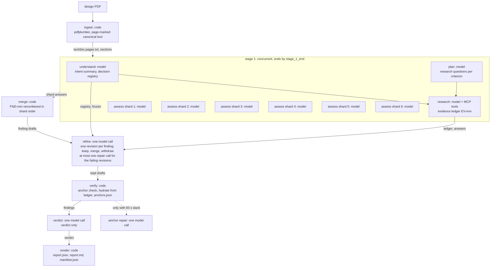

# Architecture of the design-review agent

Date: 2026-10-03, written from the tree at the `s4/arch` branch; every path below is relative to the repository root and names the file that implements the claim; brought in line with the code at the truth branch on 2026-10-04.
This is the document to read before the walkthrough of the review session (lab §5.4 part a) and the one the submission points evaluators at (lab §5.1, "understand the agent design").
The decision records behind it are `docs/DECISIONS.md` (ADR-001 to ADR-012) and the owner rulings in `docs/USER_DECISIONS.md`; this file explains the design as it runs, and cites them where a choice was theirs.

## 1. What it does

The agent reads one technical design document, works out what the design is trying to achieve, checks it against eleven review criteria, researches the claims that need outside evidence, and writes a review whose every finding is anchored to a quoted passage of the document and whose every external citation is a tool call it actually made (`agent/sit_review_agent/orchestrator.py`, `config/criteria.yaml`, `spec/finding.schema.json`).
It recommends a change only when it can say what is wrong, why, what evidence supports that, and what the change would gain, and it says "no change" with a reason when the design is sound (`spec/finding.schema.json` `Recommendation`, `prompts/assess.md`).
It runs as one command, `dra review <pdf>`, produces `report.md` and `report.json` in a run directory with every log needed to explain or replay the run, and it discloses in the report whatever it could not do (`agent/sit_review_agent/cli.py`, `agent/sit_review_agent/rundir.py`, `agent/sit_review_agent/phases/report.py`).

## 2. The shape of a run

A run is five stages in a fixed order: ingest, a concurrent first stage, refine, verify and report (`agent/sit_review_agent/states.py` `STAGE_ORDER`, `STAGE_MEMBERS`).
The first stage holds four of the eight phase names: understand, plan and the assess shards start together as soon as the document is read, and research starts when understand and plan have both ended (`agent/sit_review_agent/states.py` `STAGE_1_DEPENDS`; `agent/sit_review_agent/orchestrator.py` `Orchestrator._stage_1`).
The diagram below marks what is a model call and what is code; `dra states` prints the same graph from the stage tables, so the picture cannot drift from the code (`agent/sit_review_agent/states.py` `mermaid`).

Ingest is code: pdfplumber extracts the pages, the text is normalised and marked `[[PAGE n]]`, and the canonical text and section index are written to `text/` so that every later quote can be checked against the same bytes (`agent/sit_review_agent/phases/ingest.py`, `agent/sit_review_agent/ingest/pdf.py`, `agent/sit_review_agent/ingest/text.py`).
Understand is one model call that returns the design's intent and a registry of approved decisions and constraints, which is then frozen and hashed so that no later phase can rewrite what the document said it had decided (`agent/sit_review_agent/phases/understand.py`, `agent/sit_review_agent/state/decision_registry.py`).
Plan is one model call that returns research questions per criterion; code adds a document-only question for any criterion the model left out, so every criterion is checked (`agent/sit_review_agent/phases/plan.py` `build_plan`).
Research is a hand-written tool loop: the model asks for tool calls, the gateway runs them, every result becomes a ledger entry with an `EV-nnn` ID before the model sees it, and the stop rules decide after each round whether to continue (`agent/sit_review_agent/phases/research.py`, `agent/sit_review_agent/stop_rules.py`, `agent/sit_review_agent/state/evidence_ledger.py`).
Assess is six concurrent model calls, one per criterion group (`docs/USER_DECISIONS.md` #40), and each sees only the document and its own criteria, which is why it does not have to wait for the plan (`agent/sit_review_agent/phases/assess.py`, `config/agent.yaml` `assess.shards`).
Each stage 1 member works on its own deep copy of the run state and is merged back when it ends, so a checkpoint written while another member runs never holds half-written state (`agent/sit_review_agent/phases/_isolation.py` `isolate`, `merge_member`).
The merge is code: shard findings are renumbered `FND-nnn` in shard order and ranked by severity then confidence, so IDs never depend on which shard finished first (`agent/sit_review_agent/phases/assess.py` `AssessPhase.merge`, `rank_by_severity`).
Refine is one global model call that sees the merged findings, the frozen registry, the plan answers and the ledger, and returns one revision per finding: keep with rank, severity, disposition, decision links, evidence and a next step where the disposition needs one; merge into a kept finding; or withdraw (`agent/sit_review_agent/phases/refine.py`, `agent/sit_review_agent/llm/outputs.py` `FindingRevisionDraft`, `apply_revisions`).
An answer with revisions that break a rule is split: every revision that holds on its own is kept, and at most one repair call asks only for the findings whose revision failed; when that repair fails or is cut, the passing revisions are still applied and the findings without one stay unrefined, disclosed (`agent/sit_review_agent/phases/refine.py` `split_revisions`, `repair_outcome`, `salvage_revisions`).
Verify is code: every anchor is searched for in the canonical text, drafts are hydrated into canonical findings from the ledger, and one anchor-repair call is made only when more than 60 s of slack remain (`agent/sit_review_agent/phases/verify.py`, `agent/sit_review_agent/ingest/anchor.py` `verify_anchor`).
Report is one model call that returns only the verdict, after which code assembles the review, runs the invariants, renders the Markdown from a template and finalises the manifest (`agent/sit_review_agent/phases/report.py` `assemble_review`, `agent/sit_review_agent/report/render.py`, `agent/sit_review_agent/manifest.py`).
Before each of stage 1 and refine the orchestrator checks the caps, and a cap that fires jumps the run to verify so that a report is still produced and the cut is recorded as a degradation (`agent/sit_review_agent/orchestrator.py` `Orchestrator._cap`, `_skip_on_cap`; `agent/sit_review_agent/states.py` `STAGE_ON_CAP`).

## 3. Why this shape

The first version of the agent ran the same eight phases one after another with one assess call for all eleven criteria, and on the payments design at `high` effort that assess call alone produced 63k output tokens, a 600 s timeout killed it four times, and the run took 3,372 s of wall time (`docs/live_runs/QUALITY_COMPARISON.md`, `eval/EVAL_PLAN.md` run-time note).
Six sequential model calls cannot fit a 540 s demo slot whatever their effort, so the redesign made the first stage wide: assess does not wait for understand and plan, the criteria are split into shards that run side by side (four at first, six since `docs/USER_DECISIONS.md` #40, after stage 1 ran 265.2 s and 255 s on the lab document), and refine returns revisions instead of re-emitting every finding (`docs/DECISIONS.md` ADR-011, `docs/USER_DECISIONS.md` #31).
Measured on the same document, the concurrent agent at `medium` took 382 s and $5.74 for 21 items (18 findings and 3 strengths), with the first draft finding on screen at 77 s, and the concurrent agent at `high` took 780 s and $8.21 (`docs/live_runs/rehearsal_concurrent_1/MEASUREMENT.md`, `docs/live_runs/rehearsal_concurrent_high_1/MEASUREMENT.md`).
Quality did not pay for the speed: strict recall of the 14 planted flaws went from 11 of 14 on the sequential run to 13 of 14 on both concurrent runs, lenient recall was 14 of 14 on all three, adjudicated precision was 0.95, 0.94 and 0.95, severity-weighted recall rose from 0.73 to 0.93, and the key-blind grader gave 83.8, 83.0 and 83.8, a B each time (`docs/live_runs/QUALITY_COMPARISON.md`).
Those numbers come from one document and one run per arm, and the answer key is not signed off, so they are exploratory and justify the shape, not a claim about the population (`docs/live_runs/QUALITY_COMPARISON.md` "Caveats", `docs/USER_DECISIONS.md` #33).
Every stage has an absolute end time on the run clock rather than a fraction of the deadline, because the thinking block of a call is a fixed cost: on the demo profile stage 1 ends by 265 s, refine by 465 s and the verdict call by 530 s inside a 540 s deadline, with a refine reserve of 200 s and a verify-and-verdict reserve of 75 s (`config/profiles/demo.yaml` `stage_limits_s`, `config/stop_rules.yaml`).
The base profile keeps the same shape at 3,600 s with limits of 2,820, 3,420 and 3,540 s, and the output cap is 128,000 tokens on every stage (`config/stop_rules.yaml`, `config/agent.yaml` `max_tokens`).
The deadline is enforced inside each model call, as the attempt timeout `min(llm.timeout_s, time left - reserve)`, so one slow call cannot take the report with it (`agent/sit_review_agent/llm/runtime.py` `RunDeadline`).
The 540 s figure is a project assumption, because the lab brief states no time limit for the live run; it is a configurable safety net, not a product limit (`docs/USER_DECISIONS.md` #34, `docs/DEMO_DAY_RUNBOOK.md` unknowns line).
Underneath the stage design the loop is a custom state machine on the Anthropic Python SDK with a direct MCP client, chosen over LangGraph, PydanticAI and others on a weighted matrix (custom 92, LangGraph 80, PydanticAI 77) because every retry, degradation and log line is then our own code to show and to test (`docs/DECISIONS.md` ADR-001, `research/frameworks/README.md`).

## 4. Model access

Every model call goes through one protocol, `LLMGateway`, and phases never touch an SDK; the gateway owns retries, typed stop reasons, the one-effort-per-conversation rule and the call log (`agent/sit_review_agent/llm/gateway.py` `LLMGateway`, `EffortGuard`, `LLMCallLog`).
Two live backends implement it: the Claude Code CLI run headless as `claude -p`, which is the default and bills to the owner's subscription so that no API key is needed, and the Anthropic API, kept as an option behind the same protocol (`docs/DECISIONS.md` ADR-010, `agent/sit_review_agent/llm/backend.py` `build_llm_gateway`, `config/agent.yaml` `llm.backend`).
The CLI backend renders the tool catalogue into the system prompt and asks for a JSON envelope of tool calls or a final answer through `--json-schema`, forks a fresh CLI session per call, and strips the API key from the child environment so the call cannot bill the key by accident (`agent/README.md` "LLM backends", `config/agent.yaml` `claude_code.inherit_api_key`).
Every CLI call passes `--setting-sources ""`, so the model sees only the hashed prompt bundle and none of the owner's user-level hooks, plugins or settings (`config/agent.yaml` `claude_code.extra_args`, `docs/DECISIONS.md` ADR-012).
The gateway reads the CLI's event stream, prints one status line at least every 10 s for each open call, labels each finished item of a streamed answer as a draft, and when a limit cuts a call it keeps the last complete answer the call wrote, if there is one, else the finished items of the answer being written (`agent/sit_review_agent/progress.py` `CallTracker`, `draft_line`; `agent/sit_review_agent/llm/partial.py` `StreamParser.partial`, `_last_complete`).
A call without tools ends at its first complete answer that the gateway accepts, so a CLI that rejects that answer and starts writing it again is not waited for; a call with tools, which is research alone, keeps the CLI's own flow (`agent/sit_review_agent/llm/claude_code.py` `stop_on_repeat`, `agent/sit_review_agent/llm/partial.py` `RepeatedAnswer`).
Effort is one level per conversation and never changes within it; the demo profile runs `medium` on every stage and `low` for research, and `high` is kept as the comparison arm, on the measured ground that `high` found the same flaws at twice the time (`docs/DECISIONS.md` ADR-002, `config/profiles/demo.yaml` `effort`, `docs/USER_DECISIONS.md` #33).
The structured outputs of every phase are small draft types, not the canonical review objects, and each answer is validated before a phase uses it, with one schema-repair call and one refusal retry with professional-review framing before the phase falls back to code (`agent/sit_review_agent/llm/outputs.py`, `agent/sit_review_agent/phases/_model_calls.py` `call_model`).
Before a request is sent its size is estimated against 80 % of the model's context window and refused if it does not fit, and a connection failure on the first call of a run exits within 10 s as "no network" rather than retrying for an hour (`agent/sit_review_agent/llm/runtime.py` `ContextGuard`, `FirstCallNetwork`).
Every call and every failed attempt is one line of `llm.jsonl`, with secrets and canary values redacted and the request body hashed, which is what makes replay possible (`agent/sit_review_agent/llm/gateway.py` `redact_log_entry`, `request_sha256`).

## 5. Tools

Every tool call goes through one protocol, `ToolGateway`, assembled as a stack of layers: logging on the outside, then policy, then self-replay on resume, then fault injection, then recording, and at the bottom the live MCP client, a cassette replay or an in-process fake (`agent/sit_review_agent/tools/gateway.py` `build_tool_gateway`).
The live client is a direct MCP client over streamable HTTP with one long-lived session task per server, the pattern the owner's probe verified on all four SIT servers (`agent/sit_review_agent/tools/mcp_client.py` `ServerConnection`, `scripts/probe_mcp_servers.py`).
A session the server has closed is reopened once and the call retried once, a session idle for more than 60 s is reopened before the next call, and a tool is disabled for the run only after two genuine failures in a row, so a closed session alone never disables a tool (`agent/sit_review_agent/tools/gateway.py` `MCPToolGateway`, `PolicyToolGateway.TOOL_ERROR_LIMIT`; `config/tools.yaml` `session_idle_reopen_s`; `docs/USER_DECISIONS.md` #38).
Authentication is one shared key sent as `Authorization: Bearer <key>` from the environment variable `SIT_MCP_API_KEY`, and the value is never logged or printed (`config/tools.yaml` `auth_env`, `auth_header`; `agent/sit_review_agent/tools/mcp_client.py` `auth_headers`).
The servers scale to zero, and the probe measured cold starts of 29 to 70 s against 0.04 s warm, so the run starts a background warm-up right after the tool stack exists, overlapping ingest and understand, and allows 150 s for the first connect (`research/robustness/mcp_probe_findings.md`, `agent/sit_review_agent/orchestrator.py` `run_review`, `config/tools.yaml` `connect_timeout_s`).
Two servers are enabled, internet search and research information; browser automation is off because the server keeps one shared browser for every caller with no domain allowlist, and document intelligence is off because its only probed call rejected the sample (`config/tools.yaml`, `research/robustness/mcp_probe_findings.md`).
Tools are offered to the model by capability, under the name `<server>__<tool>`, from whatever each server's tool listing returns, so no tool name is hard-coded (`config/tools.yaml` `capabilities`, `agent/sit_review_agent/tools/gateway.py` `qualify`).
The policy layer enforces the allowlist, the URL policy and an argument sanitiser: a fetched URL must have appeared in an earlier result or in the document, a query string added to a seen URL is refused, and no secret, canary, key-shaped token or bulk document text may leave the process in a tool argument (`agent/sit_review_agent/tools/policy.py` `check_urls`, `sanitise_args`; `config/url_policy.yaml`).
A missing key fails the run fast, before any model call, unless `--no-tools` asks for a document-only review; a key revoked mid-run degrades the run to document-only and the report says so (`agent/sit_review_agent/orchestrator.py` `_run_check_tool_key`, `docs/USER_DECISIONS.md` #13).
Each result is parsed into sources, each source becomes a ledger entry with an authority class and an independence key, and the model sees the result text prefixed with the new `EV-nnn` IDs so it can cite only what it has read (`agent/sit_review_agent/tools/sources.py` `extract_sources`, `classify_authority`, `independence_key`).

## 6. Honesty and traceability

Every finding carries one to three anchors, each a verbatim quote of at least 8 tokens with a page and section, and verify searches the canonical text for it with an exact match first and a fuzzy match at 0.90 or better within the cited page plus or minus one, narrowed to the cited section plus or minus one in document order when that section resolves (`agent/sit_review_agent/ingest/anchor.py` `verify_anchor`, `verify_finding_anchors`).
A finding that keeps no resolvable anchor after the one repair turn is no longer a finding: it moves to the unresolved list marked "Unverified" with no recommendation, and a degradation discloses it (`agent/sit_review_agent/phases/verify.py` "Anchor downgrade").
The model never writes a URL; it cites ledger IDs only, and verify hydrates the URL and the retrieval time from the ledger, while a URL in free text that is not in the ledger (its scheme matched in any letter case, the URL compared as written, so a scheme recased from an allowed URL is not allowed) is replaced by a visible "link removed" marker (`agent/sit_review_agent/state/evidence_ledger.py` `hydrate`, `agent/sit_review_agent/phases/report.py` `LINK_REMOVED`).
A URL that is part of recorded source text is ledger-backed, not a model-written source: a doc URL is backed by the reviewed document's canonical text and an external URL by the tool result (the external entry's excerpt), and a doc excerpt is not itself a source of allowed URLs, since verify records a model's anchor quote as the doc excerpt when the cited quote is not in the document; the report keeps a backed URL and INV-05 accepts it, both through the one set `allowed_urls` builds, while a model-written URL found in neither is still removed and disclosed (`agent/sit_review_agent/invariants.py` `allowed_urls`, `check_INV_05`, `agent/sit_review_agent/phases/report.py` `assemble_review`).
Verbatim passages are never rewritten after verify: the redaction leaves anchor quotes and every doc or external quote that occurs in its ledger excerpt untouched, so a quote stays equal to the text INV-04 and INV-05 check it against; INV-05's URL scan skips such a doc or external quote only when each of its URLs is an exact-case URL of its excerpt or the start of one and every URL of its excerpt is itself allowed, so a quote that ends partway through a backed URL passes while any other URL in a quote is still checked (`agent/sit_review_agent/phases/report.py` `_redact`, `agent/sit_review_agent/invariants.py` `quote_backed_by_excerpt`).
Every degraded path is disclosed as a numbered degradation (`DEG-nnn`) with its event and its impact, and the report has one limitation per degradation: a deadline cut, an answer truncated twice at the output cap, a model that declined, tools down, a shard that failed (`agent/sit_review_agent/state/run_state.py` `add_degradation`, `agent/sit_review_agent/invariants.py` `check_INV_07`).
The verdict `not_assessed` is set by code only, with the reason `deadline`, `truncated` or `declined`; the model's output schema offers only `fit`, `fit_with_conditions` and `not_fit`, so the model can never declare a design unassessed (`agent/sit_review_agent/phases/report.py` `not_assessed_verdict`, `assessment_missing`; `agent/sit_review_agent/llm/outputs.py` `AssessedVerdictLabel`).
Finding IDs change at the merge, in refine and in verify, and a map from old to new ID is applied to sound areas, coverage rows and related-finding links at each step, while the verdict may cite only IDs that exist (`agent/sit_review_agent/phases/assess.py` `AssessPhase.merge`, `agent/sit_review_agent/phases/verify.py`, `agent/sit_review_agent/phases/_model_calls.py` `normalise_findings`, `reconcile_coverage`; `agent/sit_review_agent/phases/report.py` `settle_report_output`).
The ID map of each step is kept in the run state and the manifest, report text written in an earlier numbering is rewritten through it before the report is written, and INV-12 fails the run on any finding ID the review cites that is not one of its findings, beside INV-05 for a cited evidence ID that is not in the ledger (`agent/sit_review_agent/finding_refs.py`, `agent/sit_review_agent/phases/report.py` `settle_refs`, `agent/sit_review_agent/invariants.py` `check_INV_12`, `check_INV_05`).
A call cut by a limit is logged with unknown usage, never a made-up zero, and the manifest, the report and the console then call the cost a lower bound (`agent/sit_review_agent/llm/gateway.py` `unrecorded_usage`, `agent/sit_review_agent/manifest.py` `journal_usage`).
Approved decisions extracted in understand are frozen and hashed, and a finding that would reverse one must declare it as a challenge with at least two evidence items (`agent/sit_review_agent/state/decision_registry.py`, `agent/sit_review_agent/invariants.py` `check_INV_10`, `agent/sit_review_agent/phases/verify.py` `unlabelled_conflicts`).
`dra explain <finding-id>` reads only the run directory and shows a finding's anchors with their match scores, its evidence with the tool call behind each item, the criteria that produced it and its history across phases with the model call IDs (`agent/sit_review_agent/report/explain.py`).
A limitations section lists what the run could not do, written by code from the degradations, never by the model (`agent/sit_review_agent/phases/report.py` "unresolved items and limitations are written by code").

## 7. State, checkpoints, resume and replay

A run directory holds everything about the run: `manifest.json`, `report.json`, `report.md`, the ledger journal `ledger.jsonl` and its snapshot `ledger.json`, `anchors.json`, `state.json`, `checkpoints/`, `shards/`, the call logs `llm.jsonl` and `tools.jsonl`, the canonical text under `text/` and `progress.log` (`agent/sit_review_agent/rundir.py` `RunDir`).
The manifest is written before the first model call with outcome `crashed`, and finalised at exit with served models, usage, cost, timings and output hashes, so a run that dies reads as crashed and never as completed (`agent/sit_review_agent/manifest.py` `start_manifest`, `finalise_manifest`).
After every ended phase the orchestrator writes an atomic checkpoint that pins the hashes of the effective config, the prompt bundle and the canonical text, and the byte offsets of the three journals (`agent/sit_review_agent/state/checkpoint.py` `write_checkpoint`, `docs/DECISIONS.md` ADR-009).
In stage 1 every member writes its own checkpoint when it ends, the latest is chosen by ordinal rather than file name, and every finished assess shard is stored in `shards/<k>-<name>.json` so an interruption loses at most the members still running (`agent/sit_review_agent/orchestrator.py` `Orchestrator.checkpoint`, `_store_shard`, `_load_shards`).
`dra resume` loads the latest checkpoint, refuses on hash drift unless `--accept-drift` is given and recorded, truncates the ledger journal to the checkpoint offset, restores the run clock from the elapsed seconds the checkpoint recorded, and re-runs only the members and shards that had not finished (`agent/sit_review_agent/orchestrator.py` `resume_run`, `resume_start`, `_run_rerun_phases`).
Tool calls that succeeded and are in `tools.jsonl` when the run is resumed are served from there, each once, a call that failed is made again, and new call IDs continue after the highest logged one, so a resumed run never repeats a successful tool call or reuses an ID (`agent/sit_review_agent/tools/gateway.py` `SelfReplayGateway`, `agent/sit_review_agent/orchestrator.py` `_run_advance_ids`).
Model calls of an interrupted phase are re-issued and logged `resumed: true`, and the manifest sums usage from `llm.jsonl` across resumes so the whole run is accounted (`agent/sit_review_agent/llm/gateway.py` `prepare_resume`, `agent/sit_review_agent/manifest.py` `journal_usage`).
`dra replay <run_dir>` runs the real phases again into a new run directory with both gateways replaced: model calls are served from the recorded `llm.jsonl` by conversation and request hash, tool calls from `tools.jsonl`, and time from a virtual clock that follows the recorded timeline (`agent/sit_review_agent/replay.py` `ReplayLLMGateway`, `JournalReplayToolGateway`, `ReplayClock`).
A request that does not match its recording stops the replay with exit 4 rather than inventing an answer, a recorded run replays exactly only at its recorded commit because the config and prompt hashes must match, and the replayed report is stamped "replayed evidence" (`agent/sit_review_agent/replay.py` `ReplayDivergence`, `replay_run`; `agent/README.md` "Replay").
`dra review --k N` runs the same review N times as independent runs under intention to treat, so a failed run is counted and never silently replaced (`agent/sit_review_agent/kruns.py` `run_group`).

## 8. Robustness

The robustness programme is a catalogue of failure scenarios, each with an ID, grouped as infrastructure, LLM, network, input, behaviour, adversarial, operations and demo, and the runnable suite turns every scenario that can be expressed as a fault schedule into an end-to-end test through the real orchestrator (`research/robustness/scenarios.md`, `tests/robustness/README.md`).
The results table has 88 scenario rows, of which 56 pass offline and 32 are blocked as laptop-only or static, with no failures (`tests/robustness/results/robustness_summary.txt`, `tests/robustness/results/robustness_results.csv`).
A fault schedule is a YAML file that names where to hang, refuse, truncate, drop the network, crash a phase or interrupt the process, per server, per call or per assess shard, and the same file drives a live run through `--faults <ID>` (`tests/robustness/faults/`, `tests/robustness/faults_concurrent/`, `agent/sit_review_agent/tools/faults.py`).
The injectors sit below the policy and retry layers, so the test proves the policy handles the fault rather than the injector hiding it (`agent/sit_review_agent/tools/gateway.py` `FaultInjectingGateway`, `agent/sit_review_agent/llm/gateway.py` `FaultInjectingLLMGateway`, `agent/sit_review_agent/orchestrator.py` `_run_ProcessFault`).
The oracles are the run invariants: a schema-valid review, every anchor resolving, every citation in the ledger, every recommendation complete, every degradation disclosed, no secret in any file, a complete manifest and a constant registry hash (`tests/robustness/oracles.py`, `agent/sit_review_agent/invariants.py` `check_all`).
The concurrent first stage has its own six schedules and oracles: a shard that hangs, refuses, is truncated or crashes must leave the other shards' findings intact and its own criteria marked not assessed (`tests/robustness/faults_concurrent/`, `tests/robustness/concurrent_oracles.py`, `agent/sit_review_agent/orchestrator.py` `_cut_shard`).
A model that declines a section is retried once with review framing and then recorded as declined, a rate limit honours `retry-after` on the API backend and gets jittered exponential backoff on the CLI backend, whose error text carries no `retry-after`, and no model switch ever happens unless `--allow-fallback` is set and recorded in the manifest (`agent/sit_review_agent/phases/_model_calls.py`, `agent/sit_review_agent/llm/gateway.py` contract items 2 and 3, `agent/sit_review_agent/llm/claude_code.py` `_classify`, `_backoff`).
Errors are typed and map to exit codes, 0 ok, 2 usage, 3 LLM unavailable, 4 stage crash, 5 resume drift and 130 interrupted, and a run that degrades but discloses it still writes its report and exits 0 with outcome `completed_degraded` (`agent/sit_review_agent/errors.py`, `agent/sit_review_agent/manifest.py` `outcome_for`).
The demo-day runbook rehearses the five scenarios most likely to show up live, with the fault flag that reproduces each one (`docs/DEMO_DAY_RUNBOOK.md` §7).

## 9. The evaluation harness

The harness is a separate package, `sit_eval`, that the agent never imports, and a test walks the agent's syntax tree to prove it (`harness/sit_eval/`, `tests/eval_harness/test_eval_isolation.py`).
The evaluation items are three synthetic design documents with 14 planted flaws each, in a v1 and a v2 version with a sealed answer key, plus two held-out items authored without project context and sealed (`eval/synthetic/`, `eval/blind/`, `docs/SEALING.md`).
`sit-eval score` matches one review against one key: a listwise shortlist call per flaw bounds the pairs, each pair is scored 0 to 3 by a judge with a third sample only when the first two disagree, a Hungarian assignment picks the one-to-one matching, unmatched findings are adjudicated into six classes, and grounding judges check premises and citation support (`harness/sit_eval/matcher.py`, `harness/sit_eval/hungarian.py`, `harness/sit_eval/grounding.py`, `harness/README.md` "Pipeline").
Metrics are strict and lenient recall, adjudicated precision, severity-weighted recall, hallucination and fabricated-citation rates, and cost, each carrying a reason when its value is null, with cluster bootstrap, sign-flip and permutation tests over documents (`harness/sit_eval/metrics.py`, `harness/sit_eval/stats.py`, `harness/sit_eval/aggregate.py`).
`sit-eval grade` is a key-blind lecturer grader on the lab's own rubric, two samples, with a key-aware diagnostic that is kept apart from the grade (`harness/sit_eval/grader/pipeline.py`, `harness/sit_eval/grader/prompts/pass_a.txt`, `harness/sit_eval/grader/prompts/pass_b.txt`).
Judge prompts carry no run ID, model, condition or confidence, findings are shuffled with a recorded seed, and the prompt bundle is hash-locked (`harness/README.md` "Blinding", `harness/sit_eval/prompts/PROMPTS.lock`).
The analysis is pre-registered, with hypotheses, metrics and decision rules in one file and a deviations log of 12 entries that records every change since (`eval/prereg.yaml`, `eval/prereg_deviations.md`).
A guard refuses a scored run on a key that the owner has not signed off unless `--exploratory` is given, and then every artefact says so and can never become confirmatory (`harness/sit_eval/lc12.py`, `docs/USER_DECISIONS.md` #26).
Cost metrics of a run with any call of unknown usage are null with a reason, and the recorded figure is reported beside them as a lower bound, so a cut call can fail a budget check but never pass it (`harness/sit_eval/usage.py`, `docs/USER_DECISIONS.md` #28).
The caveats are the ones the quality comparison states: one document and one run per arm so far, unsigned keys and an unfrozen pre-registration, and the agent, the scoring judge and the grader all in the same model family, disclosed as such (`docs/live_runs/QUALITY_COMPARISON.md` "Caveats", `eval/EVAL_PLAN.md` §1).
Tier A, the minimum research-grade study, is 132 runs across the baselines and ablations; it is costed, scheduled around the subscription's concurrency, and not yet run (`eval/EVAL_PLAN.md` §1.2, `docs/BUDGET.md`, `docs/BUDGET_OPTIONS.md`).
The single-call baseline of the pre-registration, condition `B0`, is runnable since 5 Oct 2026 with `--condition B0`: the orchestrator skips understand, plan, research and refine and makes one assess call over every criterion of `config/agent.yaml` from the document alone, briefed by `prompts/assess_single.md`, bounded by the run deadline and not by a stage limit, with no tools, no verdict call and no anchor-repair call (`agent/sit_review_agent/orchestrator.py` `_b0_stage`, `eval/prereg.yaml` `conditions.tier_A`).
A B0 run then takes FULL's merge, verify, report and manifest path, its manifest says `condition: "B0"` (a FULL run's now says `"FULL"`), and the harness compares the two with `sit-eval aggregate --compare FULL --compare B0` (`tests/test_b0_condition.py`, `docs/transcripts/session6/b0-baseline.md`).

## 10. The UI

The user interface is a local page served by `dra ui` over the same run directory the CLI writes, bound to loopback unless `--allow-remote` is given (`agent/sit_review_agent/ui/server.py` `build_app`, `agent/sit_review_agent/cli.py` `ui_cmd`, `docs/design/ui_design.md`).
A run launched from the page is the same `dra review` subprocess, so the page adds nothing to the evaluated agent and the run directory stays the only state (`docs/design/ui_design.md`, `agent/sit_review_agent/cli.py` `run_cmd`).
Live stage tracks are fed from a structured progress journal over server-sent events: the progress sink writes one terminal-safe line per event to the console and to `progress.log`, and every event with its type and fields to `progress.jsonl`, whose records follow a schema (`agent/sit_review_agent/progress.py` `ConsoleProgress`, `ProgressJsonl`; `spec/progress_event.schema.json`; `agent/sit_review_agent/ui/events.py` `tail`).
The review is rendered from `report.json`, the same object the Markdown template renders, so the page and the file can never disagree (`agent/sit_review_agent/report/render.py` `render_markdown`, `spec/finding.schema.json`).
The page's chat is labelled "reading aid, not the review": its corpus is the finished review only, its citations are verified by the server against that review, it runs on Opus with a cap, and its log is kept outside the evaluated agent's logs (`agent/sit_review_agent/ui/chat.py` `ask`, `MAX_CALLS`, `MAX_COST_USD`).
A replayed run is stamped "replayed evidence" on the page exactly as `dra replay` stamps the report (`agent/sit_review_agent/replay.py` `BANNER_PREFIX`).
Outputs leave the laptop as a download, an email or a session-only link on the laptop's wifi address; no hosted share link exists, by decision (`docs/USER_DECISIONS.md` #36, section 11 below).
The download is a zip of the run's own `report.md` rendered as a self-contained HTML page with a sidebar of eight parts, the reviewed PDF as `document.pdf` when its SHA-256 matches the manifest, `report.md` and `report.json`, so the review in it says nothing the report does not, and a reading-aid chat, if the run has one, follows in its own section marked not part of the review (`docs/USER_DECISIONS.md` #43, `agent/sit_review_agent/ui/export.py` `GROUPS`, `split_report`, `export_zip`); the email sends it over SMTP with the password from the environment and is shown disabled with its reason until `config/ui.yaml` names a server, and the share link is the page's address on this network only when the server was started with `--allow-remote` (`agent/sit_review_agent/ui/export.py` `export_html`, `agent/sit_review_agent/ui/mail.py` `send`, `agent/sit_review_agent/ui/share.py` `share_info`, `config/ui.yaml`).
Since 5 October 2026 the page is cross-linked: every finding, evidence, limitation, sound-area, research-question and registry id, every requirement or principle id of the document, every page and section reference and every `[doc:...]` anchor is a link, and each link only wraps text already there, so the review's words are unchanged (`agent/sit_review_agent/ui/xref.py` `Index.link_text`, `tests/test_ui_export_links.py`).
The targets the review does not hold are in a Reference part after it, labelled as added by the export: how to read the review (its vocabulary from the prompts and the code, with how confidence is derived), the decision registry, the evidence ledger, and the document's extracted text with every quoted passage marked, so a reference resolves inside the one file even when it is emailed alone (`agent/sit_review_agent/ui/export.py` module docstring).
Since 3 October 2026 the page wears the v2 look the owner approved on the mockup (`docs/USER_DECISIONS.md` #41, `docs/design/ui_restyle.md`): a dark rail on the left lists the pages, the runs and the tool servers, the finished review ends in a composer that asks the review, and the Delta tab is always drawn, shown disabled with its reason when no previous version was given (`agent/sit_review_agent/ui/static/index.html`, `app.css`, `tokens.css`, `app.js` `renderTabs`, `deltaBody`).
The tools status in the rail, the top bar and the Tools page is read from the newest run directory that recorded a warm-up, so "warm" means "answered the last recorded warm-up" and never "awake now"; the page never probes on load, and a probe runs only when `Probe now` is pressed (`agent/sit_review_agent/ui/rundata.py` `tools_status`, `agent/sit_review_agent/ui/server.py` `tools_get`, `tools_probe`).
Since 4 October 2026 a live run shows a head clock that ticks each second as the recorded run clock plus the seconds since the last event, with the run's stage limits drawn as markers on one axis and a fired limit stated in plain words (`docs/USER_DECISIONS.md` #44, `agent/sit_review_agent/ui/static/app.js`).
Each stage row expands to its model calls and the titles of the items drafted so far, never the model's text, and a Logs panel in the rail tails the run's `progress.log` through a read-only route (`agent/sit_review_agent/ui/server.py` `run_log`).
Stop takes two clicks, and the confirm step says in one sentence what it does: it sends SIGINT to the `dra review` process, the run ends with exit 130, `state.json` is kept, no report is written, and `dra resume <run_id>` continues it (`agent/sit_review_agent/ui/static/app.js`).

## 11. Frozen interfaces and what is deliberately not built

The public signatures, Pydantic models, protocols, enums and constants of the models, config, states, context, state, gateway, outputs, ingest, invariants, errors, run-directory and phase-base modules are frozen; a change to one is made alone, in its own commit, with a note naming every caller (`agent/README.md` "Interface freeze").
The output contract is the JSON schema and the Pydantic models change only together with it, with a test that fails on enum drift (`spec/finding.schema.json`, `agent/sit_review_agent/models.py`, `tests/test_models.py`).
The first lines of the three live-change config files are pinned by line number, so the demo-day modifications land on the lines the runbook names (`config/agent.yaml`, `config/stop_rules.yaml`, `config/tools.yaml`, `tests/test_config_layout.py`, `docs/DEMO_DAY_RUNBOOK.md` §4.1).
The stop-reason codes are a closed enum, so a stop rule added live reuses an existing code and names itself in the detail, and the prompt bundle is hash-locked so an edit that was not meant fails a test (`agent/sit_review_agent/models.py` `StopReasonCode`, `agent/sit_review_agent/stop_rules.py`, `prompts/PROMPTS.lock`).
A multi-provider model dropdown is not built: the gateway seam exists and another provider would be one more `LLMGateway`, but another provider is not a live change and it waits until after the interview (`agent/sit_review_agent/llm/backend.py`, `docs/DEMO_DAY_RUNBOOK.md` §4.2 row 4).
Persistent memory across runs is not built beyond re-assessing an updated artefact against a frozen prior review, because cross-run learning on a small evaluation set would be an overfitting channel that nobody could rule out (`agent/sit_review_agent/orchestrator.py` `RunRequest.previous_run`, `docs/DOCUMENTATION_MAP.md` "Memory and state").
In that re-assessment every finding of the prior review gets exactly one status in the report's delta table (`prior_findings`, keyed on the prior review's own IDs: resolved, partially addressed, still open, or withdrawn on re-assessment with a reason), a prior finding the model gave no status is recorded as still open and "not re-examined" and disclosed rather than dropped (checked by INV-13 before the report is written), and a new finding anchored in a section the update changed is marked as a regression from the two saved texts (`agent/sit_review_agent/delta.py`).
A hosted public share link is not built: outputs leave the laptop as files or a session-only link, so the review of an unseen SIT document never sits on a server (`docs/design/ui_design.md`).
An in-run second-model verifier is not built: verification is code against the canonical text and the ledger, and an independent judge belongs in the harness where it can be blinded, not inside the agent where it would be scored with it (`agent/sit_review_agent/phases/verify.py`, `harness/sit_eval/grounding.py`, `docs/DECISIONS.md` ADR-003).

## 12. Comparisons made and trade-offs

| The choice | Compared against | What decided it, with the number and the file |
|---|---|---|
| A custom state-machine loop on the Anthropic SDK with a direct MCP client | LangGraph, PydanticAI, OpenAI Agents, CrewAI, smolagents | A weighted matrix, custom 92 against LangGraph 80 and PydanticAI 77, stable under three re-weightings; every retry, degradation and log line is then our own code (`research/frameworks/README.md`, `research/frameworks/comparison.md`, `docs/DECISIONS.md` ADR-001) |
| A concurrent first stage with parallel assess shards (four when measured, six since #40) | The sequential chain with one assess call | 3,372 s against 382 s on the same document, and strict recall 11 of 14 against 13 of 14 (`docs/live_runs/QUALITY_COMPARISON.md`, `docs/DECISIONS.md` ADR-011) |
| `medium` effort on every stage, research `low` | `high` on every stage | The same 13 flaws, precision 0.944 against 0.947, at 382 s and $5.74 against 780 s and $8.21; `high` kept as the comparison arm (`docs/live_runs/QUALITY_COMPARISON.md`, `docs/USER_DECISIONS.md` #33) |
| The Claude Code CLI as the default backend | The Anthropic API with a key | No key needed on the owner's machine, the same model, the API kept as an option behind one protocol (`docs/DECISIONS.md` ADR-010, `agent/sit_review_agent/llm/backend.py`) |
| Opus-only scoring judge and grader | A second-provider judge | The owner's decision on cost; the same-family limitation is disclosed and the judge path stays switchable (`docs/USER_DECISIONS.md` #16 and #23, `docs/DECISIONS.md` ADR-003, `harness/sit_eval/live_judges.py`) |
| Two MCP servers enabled | All four | The probe: document intelligence rejected its only sample, and browser automation keeps one shared browser with no allowlist (`research/robustness/mcp_probe_findings.md`, `config/tools.yaml`) |
| A local page with a grounded chat beside the review | A terminal-only UI, and a chat-first UI | Chat-first hides the review the lab judges, so the review is the page and the chat is a labelled reading aid built to the anti-slop craft rules (`docs/design/ui_design.md`) |
| A small evaluation repeated over weeks | The full 132-run Tier A study at once | Subscription concurrency limits; resume and intention-to-treat make chunking safe, and three scoped options are costed for the owner (`docs/BUDGET_OPTIONS.md`, `eval/EVAL_PLAN.md` §1.2, `agent/sit_review_agent/kruns.py`) |
| A 540 s deadline as a configurable safety net | A hard product limit | The lab brief states no time limit for the live run, so the value is a profile setting pending SIT's answer (`docs/USER_DECISIONS.md` #34, `config/profiles/demo.yaml`) |
| The custom loop kept after building a LangGraph variant of the same agent | `--orchestrator langgraph` (`agent/sit_review_agent/orchestrator_langgraph/`) | The same review on the same document (18 findings, `not_fit`) at 424.7 s against 382.3 s; parity 26 of 28 with the two failures named; 436 lines against the 153 replaced; the backstop, sibling cancellation and resume still hand-written beside the framework (`docs/COMPARISON_LANGGRAPH.md`, `tests/test_parity_langgraph.py`, `docs/live_runs/langgraph_payments_v1_1/`) |

Every comparison above was measured where it could be measured, and the number is written down beside the file that holds it.
Where it was a judgement rather than a measurement, it is a config value or a documented ruling that the owner can reverse without a code change.

## 13. Walkthrough script

1. Open `README.md` and say what the agent does in one sentence: it reviews a design against its own objectives, anchors every finding to a quoted passage, and recommends a change only when it can justify one.
2. Open `agent/sit_review_agent/states.py` and show the five stages and the stage 1 dependency table, then run `dra states` to print the same graph from the code.
3. Open `agent/sit_review_agent/orchestrator.py` at `_stage_1` and show understand, plan and the six assess shards starting as asyncio tasks, with research waiting for the first two.
4. Open `config/agent.yaml` at `assess.shards` and show the six criterion groups, and say that a criterion appended live becomes its own shard, so it adds a parallel call and not wall time.
5. Open `config/profiles/demo.yaml` and show the 540 s deadline, the three stage limits and the two reserves, and say that the deadline is enforced inside each model call in `agent/sit_review_agent/llm/runtime.py`.
6. Open `docs/live_runs/QUALITY_COMPARISON.md` and show the side-by-side table: 3,372 s to 382 s, 11 of 14 to 13 of 14 strict, the same grade, with the caveat that it is one document and one run per arm.
7. Open `agent/sit_review_agent/llm/gateway.py` and show the `LLMGateway` protocol, then `agent/sit_review_agent/llm/backend.py` to show the two backends behind it and why the CLI backend needs no API key.
8. Open `agent/sit_review_agent/tools/gateway.py` and read the layer stack in the module docstring, then `agent/sit_review_agent/tools/policy.py` for the URL policy and the argument sanitiser.
9. Open `config/tools.yaml` and `research/robustness/mcp_probe_findings.md` and say which two servers are on, why the other two are off, and what a cold start costs.
10. Open `agent/sit_review_agent/ingest/anchor.py` and show the anchor rule, then a `report.md` under `docs/live_runs/rehearsal_concurrent_1/` and point at a finding's quote, page and section.
11. Run `dra explain <finding-id>` on that run and walk the anchors, the evidence with its tool call, and the history across phases, from `agent/sit_review_agent/report/explain.py`.
12. Open `agent/sit_review_agent/phases/report.py` at `not_assessed_verdict` and say that the model can never declare a design unassessed; only code can, with a reason.
13. Open `agent/sit_review_agent/state/checkpoint.py` and `agent/sit_review_agent/replay.py` and say that a run can be resumed from its last checkpoint and replayed exactly at its recorded commit, stamped "replayed evidence".
14. Open `tests/robustness/results/robustness_summary.txt` and `tests/robustness/faults/` and show the 88 scenarios, 56 passing offline, and one fault schedule that the `--faults` flag applies to a live run.
15. Open `harness/README.md` and `eval/prereg.yaml` and close on how the agent is judged: planted flaws, a bounded matcher, a key-blind grader, a pre-registration, and a guard that marks every unsigned-key score exploratory.
