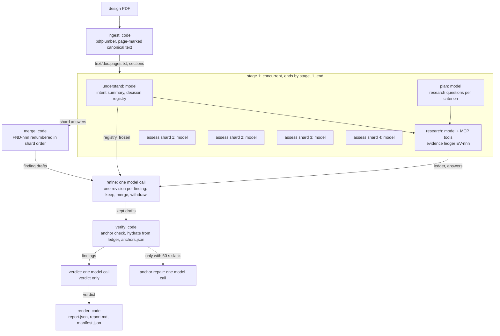

# Architecture of the design-review agent

Date: 2026-10-03, written from the tree at the `s4/arch` branch; every path below is relative to the repository root and names the file that implements the claim.
This is the document to read before the walkthrough of the review session (lab §5.4 part a) and the one the submission points evaluators at (lab §5.1, "understand the agent design").
The decision records behind it are `docs/DECISIONS.md` (ADR-001 to ADR-012) and the owner rulings in `docs/USER_DECISIONS.md`; this file explains the design as it runs, and cites them where a choice was theirs.

## 1. What it does

The agent reads one technical design document, works out what the design is trying to achieve, checks it against eleven review criteria, researches the claims that need outside evidence, and writes a review whose every finding is anchored to a quoted passage of the document and whose every external citation is a tool call it actually made (`agent/sit_review_agent/orchestrator.py`, `config/criteria.yaml`, `spec/finding.schema.json`).
It recommends a change only when it can say what is wrong, why, what evidence supports that, and what the change would gain, and it says "no change" with a reason when the design is sound (`spec/finding.schema.json` `Recommendation`, `prompts/assess.md`).
It runs as one command, `dra review <pdf>`, produces `report.md` and `report.json` in a run directory with every log needed to explain or replay the run, and it discloses in the report whatever it could not do (`agent/sit_review_agent/cli.py`, `agent/sit_review_agent/rundir.py`, `agent/sit_review_agent/phases/report.py`).

## 2. The shape of a run

A run is five stages in a fixed order: ingest, a concurrent first stage, refine, verify and report (`agent/sit_review_agent/states.py` `STAGE_ORDER`, `STAGE_MEMBERS`).
The first stage holds four of the eight phase names: understand, plan and the assess shards start together as soon as the document is read, and research starts when understand and plan have both ended (`agent/sit_review_agent/states.py` `STAGE_1_DEPENDS`; `agent/sit_review_agent/orchestrator.py` `Orchestrator._stage_1`).
The diagram below marks what is a model call and what is code; `dra states` prints the same graph from the stage tables, so the picture cannot drift from the code (`agent/sit_review_agent/states.py` `mermaid`).

Ingest is code: pdfplumber extracts the pages, the text is normalised and marked `[[PAGE n]]`, and the canonical text and section index are written to `text/` so that every later quote can be checked against the same bytes (`agent/sit_review_agent/phases/ingest.py`, `agent/sit_review_agent/ingest/pdf.py`, `agent/sit_review_agent/ingest/text.py`).
Understand is one model call that returns the design's intent and a registry of approved decisions and constraints, which is then frozen and hashed so that no later phase can rewrite what the document said it had decided (`agent/sit_review_agent/phases/understand.py`, `agent/sit_review_agent/state/decision_registry.py`).
Plan is one model call that returns research questions per criterion; code adds a document-only question for any criterion the model left out, so every criterion is checked (`agent/sit_review_agent/phases/plan.py` `build_plan`).
Research is a hand-written tool loop: the model asks for tool calls, the gateway runs them, every result becomes a ledger entry with an `EV-nnn` ID before the model sees it, and the stop rules decide after each round whether to continue (`agent/sit_review_agent/phases/research.py`, `agent/sit_review_agent/stop_rules.py`, `agent/sit_review_agent/state/evidence_ledger.py`).
Assess is four concurrent model calls, one per criterion group, and each sees only the document and its own criteria, which is why it does not have to wait for the plan (`agent/sit_review_agent/phases/assess.py`, `config/agent.yaml` `assess.shards`).
Each stage 1 member works on its own deep copy of the run state and is merged back when it ends, so a checkpoint written while another member runs never holds half-written state (`agent/sit_review_agent/phases/_isolation.py` `isolate`, `merge_member`).
The merge is code: shard findings are renumbered `FND-nnn` in shard order and ranked by severity then confidence, so IDs never depend on which shard finished first (`agent/sit_review_agent/phases/assess.py` `AssessPhase.merge`, `rank_by_severity`).
Refine is one global model call that sees the merged findings, the frozen registry, the plan answers and the ledger, and returns one revision per finding: keep with rank, severity, disposition, decision links, evidence and a next step where the disposition needs one; merge into a kept finding; or withdraw (`agent/sit_review_agent/phases/refine.py`, `agent/sit_review_agent/llm/outputs.py` `FindingRevisionDraft`, `apply_revisions`).
Verify is code: every anchor is searched for in the canonical text, drafts are hydrated into canonical findings from the ledger, and one anchor-repair call is made only when more than 60 s of slack remain (`agent/sit_review_agent/phases/verify.py`, `agent/sit_review_agent/ingest/anchor.py` `verify_anchor`).
Report is one model call that returns only the verdict, after which code assembles the review, runs the invariants, renders the Markdown from a template and finalises the manifest (`agent/sit_review_agent/phases/report.py` `assemble_review`, `agent/sit_review_agent/report/render.py`, `agent/sit_review_agent/manifest.py`).
Before each of stage 1 and refine the orchestrator checks the caps, and a cap that fires jumps the run to verify so that a report is still produced and the cut is recorded as a degradation (`agent/sit_review_agent/orchestrator.py` `Orchestrator._cap`, `_skip_on_cap`; `agent/sit_review_agent/states.py` `STAGE_ON_CAP`).

## 3. Why this shape

The first version of the agent ran the same eight phases one after another with one assess call for all eleven criteria, and on the payments design at `high` effort that assess call alone produced 63k output tokens, a 600 s timeout killed it four times, and the run took 3,372 s of wall time (`docs/live_runs/QUALITY_COMPARISON.md`, `eval/EVAL_PLAN.md` run-time note).
Six sequential model calls cannot fit a 540 s demo slot whatever their effort, so the redesign made the first stage wide: assess does not wait for understand and plan, the criteria are split into four shards that run side by side, and refine returns revisions instead of re-emitting every finding (`docs/DECISIONS.md` ADR-011, `docs/USER_DECISIONS.md` #31).
Measured on the same document, the concurrent agent at `medium` took 382 s and $5.74 for 21 items (18 findings and 3 strengths), with the first draft finding on screen at 77 s, and the concurrent agent at `high` took 780 s and $8.21 (`docs/live_runs/rehearsal_concurrent_1/MEASUREMENT.md`, `docs/live_runs/rehearsal_concurrent_high_1/MEASUREMENT.md`).
Quality did not pay for the speed: strict recall of the 14 planted flaws went from 11 of 14 on the sequential run to 13 of 14 on both concurrent runs, lenient recall was 14 of 14 on all three, adjudicated precision was 0.95, 0.94 and 0.95, severity-weighted recall rose from 0.73 to 0.93, and the key-blind grader gave 83.8, 83.0 and 83.8, a B each time (`docs/live_runs/QUALITY_COMPARISON.md`).
Those numbers come from one document and one run per arm, and the answer key is not signed off, so they are exploratory and justify the shape, not a claim about the population (`docs/live_runs/QUALITY_COMPARISON.md` "Caveats", `docs/USER_DECISIONS.md` #33).
Every stage has an absolute end time on the run clock rather than a fraction of the deadline, because the thinking block of a call is a fixed cost: on the demo profile stage 1 ends by 265 s, refine by 465 s and the verdict call by 530 s inside a 540 s deadline, with a refine reserve of 200 s and a verify-and-verdict reserve of 75 s (`config/profiles/demo.yaml` `stage_limits_s`, `config/stop_rules.yaml`).
The base profile keeps the same shape at 3,600 s with limits of 2,820, 3,420 and 3,540 s, and the output cap is 128,000 tokens on every stage (`config/stop_rules.yaml`, `config/agent.yaml` `max_tokens`).
The deadline is enforced inside each model call, as the attempt timeout `min(llm.timeout_s, time left - reserve)`, so one slow call cannot take the report with it (`agent/sit_review_agent/llm/runtime.py` `RunDeadline`).
The 540 s figure is a project assumption, because the lab brief states no time limit for the live run; it is a configurable safety net, not a product limit (`docs/USER_DECISIONS.md` #34, `docs/DEMO_DAY_RUNBOOK.md` unknowns line).
Underneath the stage design the loop is a custom state machine on the Anthropic Python SDK with a direct MCP client, chosen over LangGraph, PydanticAI and others on a weighted matrix (custom 92, LangGraph 80, PydanticAI 77) because every retry, degradation and log line is then our own code to show and to test (`docs/DECISIONS.md` ADR-001, `research/frameworks/README.md`).

## 4. Model access

Every model call goes through one protocol, `LLMGateway`, and phases never touch an SDK; the gateway owns retries, typed stop reasons, the one-effort-per-conversation rule and the call log (`agent/sit_review_agent/llm/gateway.py` `LLMGateway`, `EffortGuard`, `LLMCallLog`).
Two live backends implement it: the Claude Code CLI run headless as `claude -p`, which is the default and bills to the owner's subscription so that no API key is needed, and the Anthropic API, kept as an option behind the same protocol (`docs/DECISIONS.md` ADR-010, `agent/sit_review_agent/llm/backend.py` `build_llm_gateway`, `config/agent.yaml` `llm.backend`).
The CLI backend renders the tool catalogue into the system prompt and asks for a JSON envelope of tool calls or a final answer through `--json-schema`, forks a fresh CLI session per call, and strips the API key from the child environment so the call cannot bill the key by accident (`agent/README.md` "LLM backends", `config/agent.yaml` `claude_code.inherit_api_key`).
Every CLI call passes `--setting-sources ""`, so the model sees only the hashed prompt bundle and none of the owner's user-level hooks, plugins or settings (`config/agent.yaml` `claude_code.extra_args`, `docs/DECISIONS.md` ADR-012).
The gateway reads the CLI's event stream, prints one status line at least every 10 s for each open call, labels each finished item of a streamed answer as a draft, and keeps the finished items of a call that a limit cuts (`agent/sit_review_agent/progress.py` `CallTracker`, `draft_line`; `agent/README.md` module map, `llm/partial.py`).
Effort is one level per conversation and never changes within it; the demo profile runs `medium` on every stage and `low` for research, and `high` is kept as the comparison arm, on the measured ground that `high` found the same flaws at twice the time (`docs/DECISIONS.md` ADR-002, `config/profiles/demo.yaml` `effort`, `docs/USER_DECISIONS.md` #33).
The structured outputs of every phase are small draft types, not the canonical review objects, and each answer is validated before a phase uses it, with one schema-repair call and one refusal retry with professional-review framing before the phase falls back to code (`agent/sit_review_agent/llm/outputs.py`, `agent/sit_review_agent/phases/_model_calls.py` `call_model`).
Before a request is sent its size is estimated against 80 % of the model's context window and refused if it does not fit, and a connection failure on the first call of a run exits within 10 s as "no network" rather than retrying for an hour (`agent/sit_review_agent/llm/runtime.py` `ContextGuard`, `FirstCallNetwork`).
Every call and every failed attempt is one line of `llm.jsonl`, with secrets and canary values redacted and the request body hashed, which is what makes replay possible (`agent/sit_review_agent/llm/gateway.py` `redact_log_entry`, `request_sha256`).

## 5. Tools

Every tool call goes through one protocol, `ToolGateway`, assembled as a stack of layers: logging on the outside, then policy, then self-replay on resume, then fault injection, then recording, and at the bottom the live MCP client, a cassette replay or an in-process fake (`agent/sit_review_agent/tools/gateway.py` `build_tool_gateway`).
The live client is a direct MCP client over streamable HTTP with one long-lived session task per server, the pattern the owner's probe verified on all four SIT servers (`agent/sit_review_agent/tools/mcp_client.py` `ServerConnection`, `scripts/probe_mcp_servers.py`).
Authentication is one shared key sent as `Authorization: Bearer <key>` from the environment variable `SIT_MCP_API_KEY`, and the value is never logged or printed (`config/tools.yaml` `auth_env`, `auth_header`; `agent/sit_review_agent/tools/mcp_client.py` `auth_headers`).
The servers scale to zero, and the probe measured cold starts of 29 to 70 s against 0.04 s warm, so the run starts a background warm-up right after the tool stack exists, overlapping ingest and understand, and allows 150 s for the first connect (`research/robustness/mcp_probe_findings.md`, `agent/sit_review_agent/orchestrator.py` `run_review`, `config/tools.yaml` `connect_timeout_s`).
Two servers are enabled, internet search and research information; browser automation is off because the server keeps one shared browser for every caller with no domain allowlist, and document intelligence is off because its only probed call rejected the sample (`config/tools.yaml`, `research/robustness/mcp_probe_findings.md`).
Tools are offered to the model by capability, under the name `<server>__<tool>`, from whatever `tools/list` returns, so no tool name is hard-coded (`config/tools.yaml` `capabilities`, `agent/sit_review_agent/tools/gateway.py` `qualify`).
The policy layer enforces the allowlist, the URL policy and an argument sanitiser: a fetched URL must have appeared in an earlier result or in the document, a query string added to a seen URL is refused, and no secret, canary, key-shaped token or bulk document text may leave the process in a tool argument (`agent/sit_review_agent/tools/policy.py` `check_urls`, `sanitise_args`; `config/url_policy.yaml`).
A missing key fails the run fast, before any model call, unless `--no-tools` asks for a document-only review; a key revoked mid-run degrades the run to document-only and the report says so (`agent/sit_review_agent/orchestrator.py` `_run_check_tool_key`, `docs/USER_DECISIONS.md` #13).
Each result is parsed into sources, each source becomes a ledger entry with an authority class and an independence key, and the model sees the result text prefixed with the new `EV-nnn` IDs so it can cite only what it has read (`agent/sit_review_agent/tools/sources.py` `extract_sources`, `classify_authority`, `independence_key`).

## 6. Honesty and traceability

Every finding carries one to three anchors, each a verbatim quote of at least 8 tokens with a page and section, and verify searches the canonical text for it with an exact match first and a fuzzy match at 0.90 or better within the cited page plus or minus one (`agent/sit_review_agent/ingest/anchor.py` `verify_anchor`, `verify_finding_anchors`).
A finding that keeps no resolvable anchor after the one repair turn is no longer a finding: it moves to the unresolved list marked "Unverified" with no recommendation, and a degradation discloses it (`agent/sit_review_agent/phases/verify.py` "Anchor downgrade").
The model never writes a URL; it cites ledger IDs only, and verify hydrates the URL, title and retrieval time from the ledger, while a URL in free text that is not in the ledger is replaced by a visible "link removed" marker (`agent/sit_review_agent/state/evidence_ledger.py` `hydrate`, `agent/sit_review_agent/phases/report.py` `LINK_REMOVED`).
Every degraded path is disclosed as a numbered degradation (`DEG-nnn`) with its event and its impact, and the report has one limitation per degradation: a deadline cut, an answer truncated twice at the output cap, a model that declined, tools down, a shard that failed (`agent/sit_review_agent/state/run_state.py` `add_degradation`, `agent/sit_review_agent/invariants.py` `check_INV_07`).
The verdict `not_assessed` is set by code only, with the reason `deadline`, `truncated` or `declined`; the model's output schema offers only `fit`, `fit_with_conditions` and `not_fit`, so the model can never declare a design unassessed (`agent/sit_review_agent/phases/report.py` `not_assessed_verdict`, `assessment_missing`; `agent/sit_review_agent/llm/outputs.py` `AssessedVerdictLabel`).
Finding IDs change at the merge, in refine and in verify, and a map from old to new ID is applied to sound areas, coverage rows and related-finding links at each step, while the verdict may cite only IDs that exist (`agent/sit_review_agent/phases/assess.py` `AssessPhase.merge`, `agent/sit_review_agent/phases/verify.py`, `agent/sit_review_agent/phases/_model_calls.py` `normalise_findings`, `reconcile_coverage`; `agent/sit_review_agent/phases/report.py` `settle_report_output`).
A dedicated invariant that fails the run on any dangling cited ID (INV-12) is designed and is not in this tree; today INV-05 fails the run on a cited evidence ID that is not in the ledger (`agent/sit_review_agent/invariants.py` `check_INV_05`).
A call cut by a limit is logged with unknown usage, never a made-up zero, and the manifest, the report and the console then call the cost a lower bound (`agent/sit_review_agent/llm/gateway.py` `unrecorded_usage`, `agent/sit_review_agent/manifest.py` `journal_usage`).
Approved decisions extracted in understand are frozen and hashed, and a finding that would reverse one must declare it as a challenge with at least two evidence items (`agent/sit_review_agent/state/decision_registry.py`, `agent/sit_review_agent/invariants.py` `check_INV_10`, `agent/sit_review_agent/phases/verify.py` `unlabelled_conflicts`).
`dra explain <finding-id>` reads only the run directory and shows a finding's anchors with their match scores, its evidence with the tool call behind each item, the criteria that produced it and its history across phases with the model call IDs (`agent/sit_review_agent/report/explain.py`).
A limitations section lists what the run could not do, written by code from the degradations, never by the model (`agent/sit_review_agent/phases/report.py` "unresolved items and limitations are written by code").
