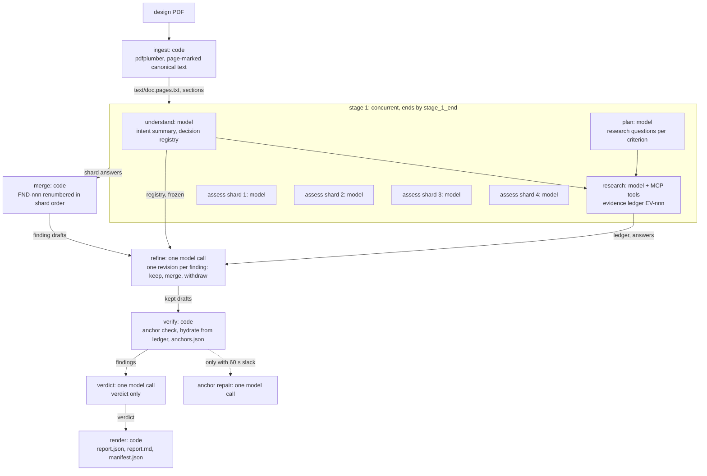

# Architecture of the design-review agent

Date: 2026-10-03, written from the tree at the `s4/arch` branch; every path below is relative to the repository root and names the file that implements the claim.
This is the document to read before the walkthrough of the review session (lab §5.4 part a) and the one the submission points evaluators at (lab §5.1, "understand the agent design").
The decision records behind it are `docs/DECISIONS.md` (ADR-001 to ADR-012) and the owner rulings in `docs/USER_DECISIONS.md`; this file explains the design as it runs, and cites them where a choice was theirs.

## 1. What it does

The agent reads one technical design document, works out what the design is trying to achieve, checks it against eleven review criteria, researches the claims that need outside evidence, and writes a review whose every finding is anchored to a quoted passage of the document and whose every external citation is a tool call it actually made (`agent/sit_review_agent/orchestrator.py`, `config/criteria.yaml`, `spec/finding.schema.json`).
It recommends a change only when it can say what is wrong, why, what evidence supports that, and what the change would gain, and it says "no change" with a reason when the design is sound (`spec/finding.schema.json` `Recommendation`, `prompts/assess.md`).
It runs as one command, `dra review <pdf>`, produces `report.md` and `report.json` in a run directory with every log needed to explain or replay the run, and it discloses in the report whatever it could not do (`agent/sit_review_agent/cli.py`, `agent/sit_review_agent/rundir.py`, `agent/sit_review_agent/phases/report.py`).

## 2. The shape of a run

A run is five stages in a fixed order: ingest, a concurrent first stage, refine, verify and report (`agent/sit_review_agent/states.py` `STAGE_ORDER`, `STAGE_MEMBERS`).
The first stage holds four of the eight phase names: understand, plan and the assess shards start together as soon as the document is read, and research starts when understand and plan have both ended (`agent/sit_review_agent/states.py` `STAGE_1_DEPENDS`; `agent/sit_review_agent/orchestrator.py` `Orchestrator._stage_1`).
The diagram below marks what is a model call and what is code; `dra states` prints the same graph from the stage tables, so the picture cannot drift from the code (`agent/sit_review_agent/states.py` `mermaid`).

Ingest is code: pdfplumber extracts the pages, the text is normalised and marked `[[PAGE n]]`, and the canonical text and section index are written to `text/` so that every later quote can be checked against the same bytes (`agent/sit_review_agent/phases/ingest.py`, `agent/sit_review_agent/ingest/pdf.py`, `agent/sit_review_agent/ingest/text.py`).
Understand is one model call that returns the design's intent and a registry of approved decisions and constraints, which is then frozen and hashed so that no later phase can rewrite what the document said it had decided (`agent/sit_review_agent/phases/understand.py`, `agent/sit_review_agent/state/decision_registry.py`).
Plan is one model call that returns research questions per criterion; code adds a document-only question for any criterion the model left out, so every criterion is checked (`agent/sit_review_agent/phases/plan.py` `build_plan`).
Research is a hand-written tool loop: the model asks for tool calls, the gateway runs them, every result becomes a ledger entry with an `EV-nnn` ID before the model sees it, and the stop rules decide after each round whether to continue (`agent/sit_review_agent/phases/research.py`, `agent/sit_review_agent/stop_rules.py`, `agent/sit_review_agent/state/evidence_ledger.py`).
Assess is four concurrent model calls, one per criterion group, and each sees only the document and its own criteria, which is why it does not have to wait for the plan (`agent/sit_review_agent/phases/assess.py`, `config/agent.yaml` `assess.shards`).
Each stage 1 member works on its own deep copy of the run state and is merged back when it ends, so a checkpoint written while another member runs never holds half-written state (`agent/sit_review_agent/phases/_isolation.py` `isolate`, `merge_member`).
The merge is code: shard findings are renumbered `FND-nnn` in shard order and ranked by severity then confidence, so IDs never depend on which shard finished first (`agent/sit_review_agent/phases/assess.py` `AssessPhase.merge`, `rank_by_severity`).
Refine is one global model call that sees the merged findings, the frozen registry, the plan answers and the ledger, and returns one revision per finding: keep with rank, severity, disposition, decision links, evidence and a next step where the disposition needs one; merge into a kept finding; or withdraw (`agent/sit_review_agent/phases/refine.py`, `agent/sit_review_agent/llm/outputs.py` `FindingRevisionDraft`, `apply_revisions`).
Verify is code: every anchor is searched for in the canonical text, drafts are hydrated into canonical findings from the ledger, and one anchor-repair call is made only when more than 60 s of slack remain (`agent/sit_review_agent/phases/verify.py`, `agent/sit_review_agent/ingest/anchor.py` `verify_anchor`).
Report is one model call that returns only the verdict, after which code assembles the review, runs the invariants, renders the Markdown from a template and finalises the manifest (`agent/sit_review_agent/phases/report.py` `assemble_review`, `agent/sit_review_agent/report/render.py`, `agent/sit_review_agent/manifest.py`).
Before each of stage 1 and refine the orchestrator checks the caps, and a cap that fires jumps the run to verify so that a report is still produced and the cut is recorded as a degradation (`agent/sit_review_agent/orchestrator.py` `Orchestrator._cap`, `_skip_on_cap`; `agent/sit_review_agent/states.py` `STAGE_ON_CAP`).
